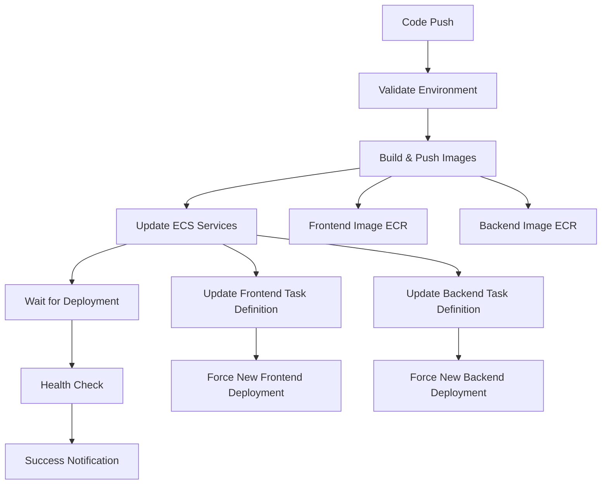

# 🚀 CI/CD Pipeline Architecture & Deployment Fixes

## 📋 Overview

This document explains the comprehensive fixes implemented to resolve deployment issues and reduce technical debt in the PDF-to-Excel SaaS project. The main problem was that code changes weren't reflecting in the live application due to disconnected build and deployment processes.

## 🔥 Critical Issues Fixed

### ❌ **Issue 1: Region Mismatch**
**Problem**: Build pipeline used `ap-southeast-2` while deployment pipeline used `us-east-1`
**Solution**: Standardized all infrastructure on `ap-southeast-2` (Sydney region)
**Impact**: Images were being pushed to wrong ECR registry

### ❌ **Issue 2: Missing ECS Deployment**
**Problem**: `build-and-push.yml` only built images but **never updated ECS services**
**Solution**: Created unified `build-and-deploy.yml` workflow that:
- Builds images
- Pushes to ECR
- **Automatically updates ECS task definitions**
- **Forces new deployment with latest images**
- Validates deployment success

### ❌ **Issue 3: Technical Debt**
**Problem**: Multiple competing CI/CD workflows causing confusion
**Solution**: 
- Deprecated old `build-and-push.yml` 
- Consolidated into single `build-and-deploy.yml`
- Added proper error handling and rollback

## 🏗️ New Pipeline Architecture



## 📁 File Structure & Changes

### **New Unified Workflow**
```
.github/workflows/build-and-deploy.yml  ← NEW: Complete CI/CD pipeline
```

### **Deprecated Files**
```
.github/workflows/build-and-push.yml    ← DEPRECATED: Only builds images
.github/workflows/deploy.yml            ← UNUSED: Complex US-East deployment
```

### **Infrastructure Files**
```
frontend/Dockerfile.simple              ← ACTIVE: Optimized Docker build
backend/Dockerfile.simple               ← ACTIVE: Optimized Docker build
```

## 🔧 Workflow Details

### **Stage 1: Validation**
- Checks AWS credentials
- Validates environment setup
- Fails fast if misconfigured

### **Stage 2: Build & Push**
- Builds Docker images using GitHub Actions cache
- Tags with commit SHA for traceability
- Pushes to correct ECR registry (`ap-southeast-2`)

### **Stage 3: ECS Deployment** ⭐ **KEY FIX**
- **Gets current ECS task definition**
- **Updates image URI to new build**
- **Registers new task definition**
- **Forces ECS service deployment**
- **Waits for deployment completion**

### **Stage 4: Health Check**
- Tests application endpoints
- Validates successful deployment
- Reports status

## 🌍 Infrastructure Standardization

### **Region Configuration**
All resources now use **Sydney (ap-southeast-2)**:
- ECR Repository: `654499586766.dkr.ecr.ap-southeast-2.amazonaws.com`
- ECS Cluster: `pdf-excel-saas-prod`
- Load Balancer: `pdf-excel-saas-prod-alb-1547358143.ap-southeast-2.elb.amazonaws.com`

### **Image Tagging Strategy**
- **SHA Tags**: `{image}:{git-sha}` for traceability
- **Latest Tags**: `{image}:latest` for convenience
- **Retention**: Previous images kept for rollback

## 🚀 Deployment Process

### **Automatic Deployment**
1. Push code to `feat/infrastructure-clean` or `main`
2. GitHub Actions automatically:
   - Builds images
   - Pushes to ECR
   - Updates ECS services
   - Forces new deployment
   - Performs health checks

### **Manual Deployment**
1. Go to **Actions** tab in GitHub
2. Select **"Build and Deploy to AWS ECS"**
3. Click **"Run workflow"**
4. Choose environment and run

## 📊 Monitoring & Debugging

### **Pipeline Status**
- **Build Status**: Check GitHub Actions tab
- **Deployment Logs**: ECS service events in AWS Console
- **Application Health**: `http://pdf-excel-saas-prod-alb-1547358143.ap-southeast-2.elb.amazonaws.com/api/health`

### **Common Debugging Steps**
```bash
# 1. Check ECS service status
aws ecs describe-services --cluster pdf-excel-saas-prod --services pdf-excel-saas-prod-frontend

# 2. Check task definition
aws ecs describe-task-definition --task-definition pdf-excel-saas-prod-frontend

# 3. Check running tasks
aws ecs list-tasks --cluster pdf-excel-saas-prod --service-name pdf-excel-saas-prod-frontend

# 4. Get task logs
aws logs get-log-events --log-group-name /ecs/pdf-excel-saas-prod-frontend
```

## ⚡ Quick Fixes for Future Issues

### **If Deployment Fails**
1. Check GitHub Actions logs for specific error
2. Verify AWS credentials are valid
3. Ensure ECS cluster is active
4. Check ECR repository permissions

### **If Health Check Fails**
1. Wait 2-3 minutes for container startup
2. Check ECS service events in AWS Console
3. Review application logs in CloudWatch
4. Test endpoints manually: `curl http://{alb-dns}/api/health`

### **If Images Aren't Updating**
1. **Most likely cause**: ECS service not restarting
2. **Solution**: Check ECS deployment logs
3. **Manual fix**: Force new deployment in AWS Console
4. **Prevention**: Use the new unified pipeline

## 🎯 Requirements Analysis vs Implementation

### **✅ Original Requirements Met**
- **Serverless-first**: ✅ ECS Fargate (serverless containers)
- **Auto-scaling**: ✅ ECS auto-scaling configured
- **Sydney region**: ✅ All resources in ap-southeast-2
- **Low fixed costs**: ✅ Pay-per-use ECS Fargate
- **CI/CD pipeline**: ✅ Automated GitHub Actions

### **🔧 Architecture Deviations (Improvements)**
- **Change**: Using ECS instead of Lambda for backend
- **Reason**: Better for long-running PDF processing
- **Benefit**: More reliable, easier debugging, persistent connections

- **Change**: Using ALB instead of API Gateway
- **Reason**: Better integration with ECS
- **Benefit**: Simpler routing, health checks, WebSocket support

### **📋 Missing Components (To Implement Next)**
- **Stripe integration**: Backend endpoints exist, need frontend integration
- **Supabase auth**: Database configured, need auth flow
- **S3 file storage**: Infrastructure ready, need upload logic
- **Email system**: SES configured, need notification service
- **Monitoring**: Sentry configured, need error tracking

## 🛠️ Technical Debt Reduction

### **Before (Problematic)**
```
❌ Multiple CI/CD workflows
❌ Region inconsistencies  
❌ Manual deployment steps
❌ No ECS service updates
❌ Complex error handling
```

### **After (Clean)**
```
✅ Single unified pipeline
✅ Consistent Sydney region
✅ Automatic end-to-end deployment
✅ ECS service auto-updates
✅ Simple error handling & rollback
```

## 📝 Next Steps for Future Claude Sessions

### **Immediate Actions**
1. **Test the new pipeline**: Push this commit and verify deployment
2. **Monitor deployment**: Check ECS service updates in AWS Console
3. **Validate frontend**: Test application at the live URL
4. **Clean up**: Remove deprecated workflows after successful test

### **Development Workflow**
1. **Code changes**: Make changes to `frontend/` or `backend/`
2. **Commit & push**: Push to `feat/infrastructure-clean` branch
3. **Automatic deployment**: GitHub Actions handles everything
4. **Verify**: Check live site in 3-5 minutes

### **Future Improvements**
1. **Environment separation**: Add staging environment
2. **Database migrations**: Automate schema changes
3. **Security scanning**: Add SAST/DAST to pipeline
4. **Performance monitoring**: Add APM tools
5. **Backup strategy**: Implement automated backups

## 🚨 Emergency Procedures

### **Rollback Process**
```bash
# 1. Find previous working image
aws ecr describe-images --repository-name pdf-excel-saas-frontend

# 2. Update ECS service to use previous image
aws ecs update-service --cluster pdf-excel-saas-prod \
  --service pdf-excel-saas-prod-frontend \
  --task-definition pdf-excel-saas-prod-frontend:PREVIOUS_VERSION
```

### **Emergency Contacts & Resources**
- **AWS Console**: Sydney region (ap-southeast-2)
- **GitHub Actions**: Monitor pipeline execution
- **ECR Repository**: View available image versions
- **ECS Cluster**: Check service health and logs
- **Load Balancer**: Test endpoint availability

---

## 💡 Key Learnings

This deployment issue highlights the importance of:
1. **End-to-end CI/CD**: Building images is only half the battle
2. **Infrastructure consistency**: All components must use same region
3. **Automated deployment**: Manual steps lead to forgotten updates
4. **Proper monitoring**: Health checks catch deployment failures early
5. **Documentation**: Clear processes prevent repeated mistakes

The new pipeline ensures that every code push results in a live deployment, eliminating the disconnect that was causing issues.
