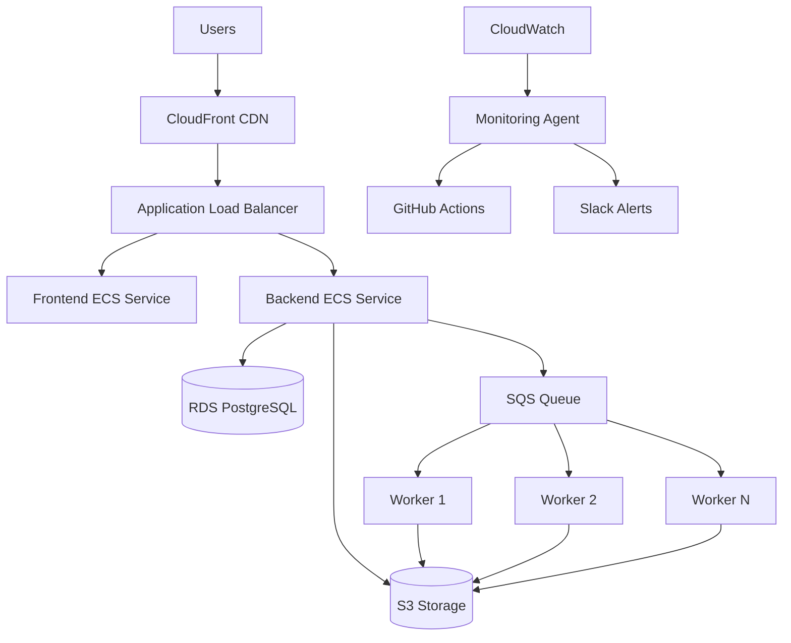

# PDF to Excel SaaS - Production Deployment Guide

## 🚀 Production Architecture Overview



## 📋 Prerequisites

• **AWS Account** with appropriate permissions
• **Domain name** for your application
• **Stripe account** for payments
• **PostHog account** for analytics
• **Sentry account** for error tracking
• **Supabase project** for authentication

## 🔧 AWS Infrastructure Setup

### 1. Create S3 Bucket
```bash
aws s3 mb s3://pdf-excel-saas-prod --region us-east-1
aws s3api put-bucket-versioning --bucket pdf-excel-saas-prod --versioning-configuration Status=Enabled
```

### 2. Create RDS Database
```bash
aws rds create-db-instance \
  --db-instance-identifier pdf-excel-db \
  --db-instance-class db.t3.micro \
  --engine postgres \
  --master-username dbadmin \
  --master-user-password YourSecurePassword123 \
  --allocated-storage 20 \
  --storage-type gp2 \
  --vpc-security-group-ids sg-12345678 \
  --db-subnet-group-name default
```

### 3. Create ECS Cluster
```bash
aws ecs create-cluster --cluster-name pdf-excel-cluster
```

### 4. Create ECR Repositories
```bash
aws ecr create-repository --repository-name pdf-excel-frontend
aws ecr create-repository --repository-name pdf-excel-backend
```

### 5. Create Application Load Balancer
```bash
aws elbv2 create-load-balancer \
  --name pdf-excel-alb \
  --subnets subnet-12345678 subnet-87654321 \
  --security-groups sg-12345678
```

## 🔑 Environment Configuration

### 1. Copy Environment Template
```bash
cp .env.example .env.prod
```

### 2. Configure Required Variables
Edit `.env.prod` with your actual values:

**Critical Variables:**
- `AWS_ACCESS_KEY_ID` & `AWS_SECRET_ACCESS_KEY`
- `DATABASE_URL` (RDS connection string)
- `AWS_S3_BUCKET_NAME`
- `STRIPE_SECRET_KEY` & `NEXT_PUBLIC_STRIPE_PUBLISHABLE_KEY`
- `SUPABASE_URL` & `SUPABASE_SERVICE_ROLE_KEY`

## 🏗️ Deployment Steps

### 1. Set GitHub Secrets
Add these secrets to your GitHub repository:

```bash
# AWS
AWS_ACCESS_KEY_ID
AWS_SECRET_ACCESS_KEY

# Database
DATABASE_URL

# Stripe
STRIPE_SECRET_KEY
STRIPE_WEBHOOK_SECRET

# Monitoring
SLACK_WEBHOOK_URL
GITHUB_TOKEN

# Other services
SUPABASE_SERVICE_ROLE_KEY
SENTRY_AUTH_TOKEN
POSTHOG_PROJECT_API_KEY
```

### 2. Deploy via GitHub Actions
```bash
git push origin main
```

The CI/CD pipeline will:
• Run tests
• Build Docker images
• Push to ECR
• Deploy to ECS
• Run health checks

### 3. Manual Deployment (Alternative)
```bash
# Build and push images
docker build -f frontend/Dockerfile.prod -t pdf-excel-frontend .
docker build -f backend/Dockerfile.prod -t pdf-excel-backend .

# Tag and push to ECR
docker tag pdf-excel-frontend:latest 123456789.dkr.ecr.us-east-1.amazonaws.com/pdf-excel-frontend:latest
docker push 123456789.dkr.ecr.us-east-1.amazonaws.com/pdf-excel-frontend:latest

# Deploy with Docker Compose
docker-compose -f docker-compose.prod.yml up -d
```

## 🔍 Monitoring Setup

### 1. Deploy Monitoring Agent
```bash
# Run monitoring agent
python monitoring/intelligent_agent.py
```

### 2. Configure CloudWatch Dashboards
Create custom dashboards for:
- Application performance metrics
- Error rates and response times
- Resource utilization
- Business metrics (conversions, revenue)

### 3. Set Up Alerts
Configure alerts for:
- High error rates (>5%)
- Response time > 2 seconds
- Memory usage > 80%
- Failed conversions > 10%

## 💰 Cost Optimization

### 1. Right-sizing Resources
- **ECS Tasks**: Start with 0.25 vCPU, 512 MB RAM
- **RDS**: Use t3.micro for development, scale as needed
- **S3**: Enable Intelligent Tiering

### 2. Auto-scaling Configuration
```yaml
# ECS Auto Scaling
MinCapacity: 1
MaxCapacity: 10
TargetCPUUtilization: 70%
TargetMemoryUtilization: 80%
```

### 3. Spot Instances for Workers
Use spot instances for background workers to reduce costs by up to 90%.

## 🔒 Security Best Practices

### 1. Network Security
- Use VPC with private subnets
- Configure security groups with minimal access
- Enable VPC Flow Logs

### 2. Data Security
- Enable S3 bucket encryption
- Use RDS encryption at rest
- Implement IAM roles with least privilege

### 3. Application Security
- Use HTTPS everywhere (SSL/TLS)
- Implement proper input validation
- Regular security audits with Snyk/SonarQube

## 📊 Business Model Implementation

### Free Tier Limits
- 5 conversions per day
- 7-day file retention
- Basic support

### Pro Tier ($9.99/month)
- Unlimited conversions
- 90-day file retention
- Priority support
- API access
- Batch processing

### Implementation
Stripe webhooks automatically update user subscription status in the database.

## 🎯 Performance Benchmarks

### Target Metrics
- **Uptime**: 99.9%
- **Response Time**: < 2 seconds
- **Conversion Time**: < 30 seconds
- **Error Rate**: < 1%

### Load Testing
```bash
# Use Apache Bench for load testing
ab -n 1000 -c 10 https://yourapp.com/api/health
```

## 🚀 Scaling Strategy

### Horizontal Scaling
- Auto-scale ECS services based on CPU/memory
- Use multiple workers for background jobs
- Implement database read replicas

### Vertical Scaling
- Monitor resource usage and upgrade instance types
- Optimize database queries and indexing
- Use Redis for caching frequently accessed data

## 📈 Analytics & Insights

### PostHog Events to Track
- User registration/login
- File uploads and conversions
- Subscription upgrades/downgrades
- Feature usage patterns
- Error occurrences

### Business Intelligence
- Conversion rates by user segment
- Revenue attribution
- Customer lifetime value
- Churn analysis

## 🔧 Troubleshooting Guide

### Common Issues

**1. Upload Failures**
- Check S3 bucket permissions
- Verify CORS configuration
- Monitor CloudWatch logs

**2. Conversion Timeouts**
- Scale up worker instances
- Check PDF file complexity
- Optimize conversion algorithms

**3. High Error Rates**
- Review Sentry error reports
- Check database connection pool
- Monitor memory usage

### Debug Commands
```bash
# Check ECS service status
aws ecs describe-services --cluster pdf-excel-cluster --services pdf-excel-backend-service

# View CloudWatch logs
aws logs tail /ecs/pdf-excel-backend --follow

# Monitor S3 usage
aws s3api list-objects --bucket pdf-excel-saas-prod --query 'length(Contents[])'
```

## 📞 Support & Maintenance

### Regular Maintenance Tasks
- Database backups and cleanup
- S3 lifecycle policies
- Security updates
- Performance monitoring

### Emergency Contacts
- AWS Support (for infrastructure issues)
- Development team (for application bugs)
- Monitoring alerts via Slack

## 🎉 Go-Live Checklist

- [ ] AWS infrastructure provisioned
- [ ] Domain configured with SSL certificate
- [ ] Environment variables set
- [ ] Database migrations run
- [ ] Stripe webhooks configured
- [ ] Monitoring agent deployed
- [ ] Load testing completed
- [ ] Security audit passed
- [ ] Backup procedures tested
- [ ] Documentation updated

## 📚 Additional Resources

- [AWS ECS Documentation](https://docs.aws.amazon.com/ecs/)
- [Next.js Deployment Guide](https://nextjs.org/docs/deployment)
- [Stripe Integration Guide](https://stripe.com/docs)
- [PostHog Analytics](https://posthog.com/docs)
- [Sentry Error Tracking](https://docs.sentry.io/)

---

## 🤖 Auto-Recovery Agent Features

The intelligent monitoring agent provides:

• **Real-time Health Monitoring**: Continuous checks on all services
• **Automatic Issue Detection**: AI-powered anomaly detection
• **Self-Healing Capabilities**: Auto-restart services, scale resources
• **Intelligent Hotfix Generation**: Code fixes for common issues
• **GitHub Integration**: Automatic PR creation for critical fixes
• **Slack Notifications**: Real-time alerts and status updates

### Agent Configuration
```python
# Enable/disable auto-recovery features
AUTO_FIX_ENABLED=true
MONITORING_INTERVAL=60  # seconds
ERROR_THRESHOLD=10      # errors per minute
```

The agent can automatically:
1. Restart failed services
2. Scale workers during high load
3. Deploy hotfixes for critical issues
4. Create GitHub PRs for manual review
5. Send detailed alerts to your team

**Ready for production deployment!** 🚀